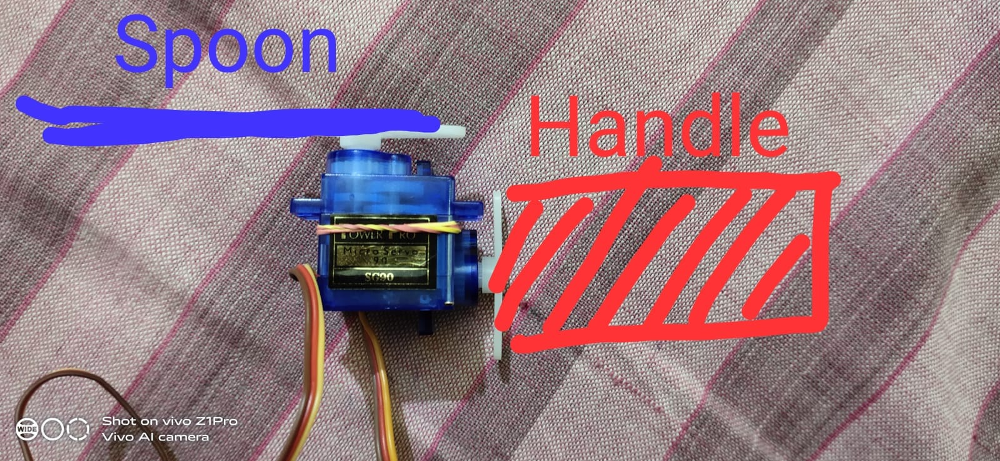
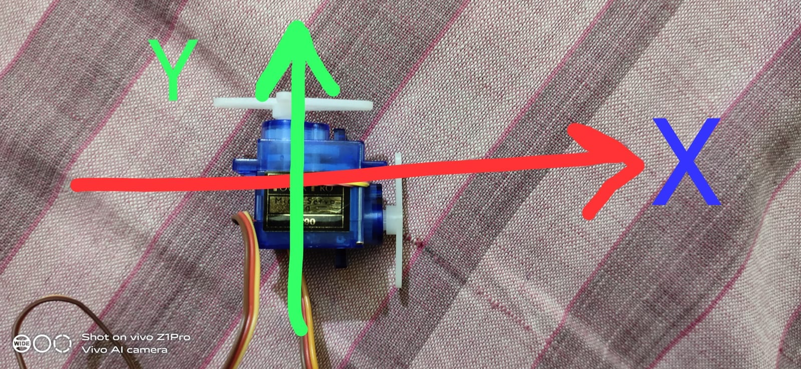
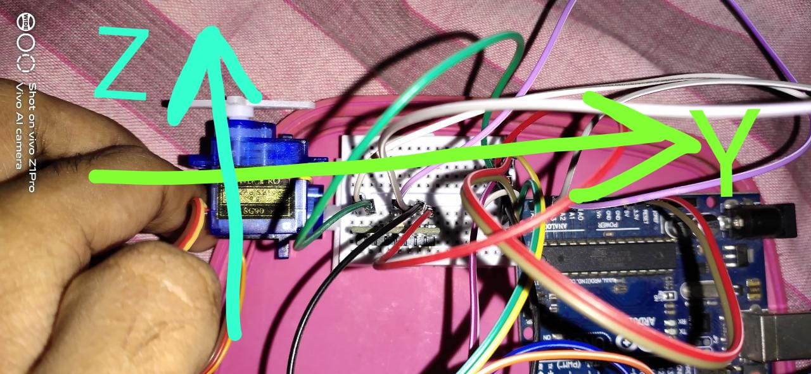

# Parkinson-s-Disease-Spoon
This Project is based on Arduino, aims to solve "feed with spoon" problems for people with Parkinson's Disease

### Initial Design - Thought

*Rough Schematic Diagram on Servo*

*Planned Axes*

### Axis Revision

*New Axes, in accordance to the MPU6050 set-up axes*

### Useful Links
[Assistive Spoon for Patients with Parkinson's ](https://create.arduino.cc/projecthub/RupinC/assistive-spoon-for-patients-with-parkinson-s-3628b6)

[Self-Stabilizing Spoon for Parkinson's Sufferers](https://create.arduino.cc/projecthub/leesanggyu/self-stabilizing-spoon-for-parkinson-s-sufferers-7bc5a7)